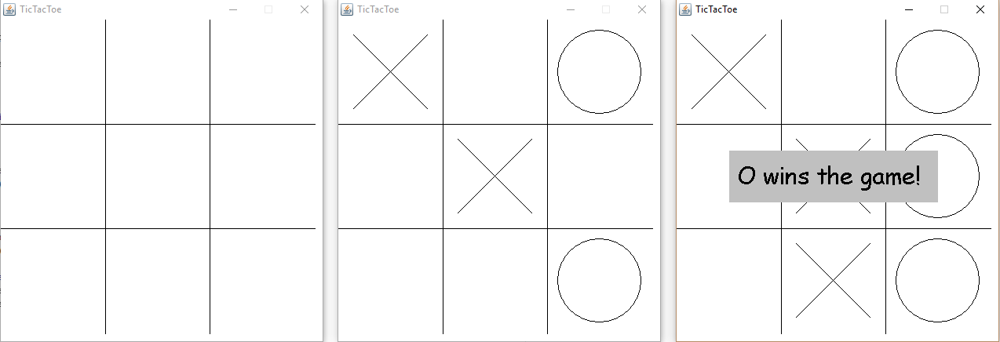

# TicTacToe
## Phase 1: Getting Started
You will be building an interactive Tic Tac Toe game in Java using the Swing and awt libraries. The final product should looks something like this:

Get oriented with the starter code. 
* `Game.java` is your main game class. It should contain all of the game logic and manage the creation and destruction of graphics `Element`s. Ideally, however, it will not contain any drawing code itself. Key features to include:
    - An instance of GameGraphics
    - A 2D array of the game state
    - Any necessary variables to maintain game win and turn status
    - Ways to win a game: X, O, Cat's Game
    - Make sure I can make any size tic tac toe grid
* `GameGraphics.java` is the graphics class that keeps an inventory of all drawable elements and draws them. It should do as little direct drawing as possible and instead defer drawing to the  `draw()` method in each `Element`.
* `Element.java` is a basic interface for a drawable element. All implementing classes should have a `draw()` method that draws the desired element on the provided `Graphics` object. How you write these implementing classes is up to you. All elements should include:
    - Custom Constructors to specify all required parameters for that element (i.e. position, board resolution, radius, etc.)
    - Be able to draw the desired element on a `Canvas` given the `Graphics` object.
    - Be sure to add the elements to the `GameGraphics` instance.

Work in `Game.java`. Your first task is to create a game window that can recieve mouse events. This can be done with a couple imports and the correct declaration of the `Game` class. For now use print statements to test that your window can properly register clicks everywhere in the window. Make sure to also disable window resizing so a curious player can't mess with the game.

By the end of this phase, you should be able to:
* Create a game window of correct size
* Have an appropriate window title (i.e. Tic Tac Toe)
* Window background is white
* Recieve clicks in the window
* Access the position clicked in the window
* Non-resizable window

##### Potentially Helpful classes:
- `javax.swing.JFrame`
- `java.awt.event.MouseListener`
- `java.awt.Graphics`

##### Hints:
- Classes can concurrently extend and implement two different classes. i.e. `class A extends B implements C`.
- The `MouseListener` should be added to all content in a `JFrame`, not just the frame itself. I'm looking at you, `Canvas`.
- Setting the size of a `JFrame` sets the window size, not the content size. To set the content size correctly, do the following:
    ```
    //Resolution is the resolution variable
    f.getContentPane().setPreferredSize(new Dimension(resolution, resolution));
    f.pack();
    ```


## Phase 2: Graphics Elements
Work in `graphics` package. You will now implement the necessary graphics elments for this project. You must be able to draw a grid, X, O, and win/lose/tie messages. There are a number of ways to achieve this, but you will be using a modular approach. Create an element for each element you want to draw. you will have to create a new class for each of these new elements. The details are up to you, but here are some guidelines:
* The grid element should be able to draw a full grid on a given window regardless of the provided window size. Think about what kind of constructor parameters are required to achieve this. Hint: `Graphics.drawLine()`
* X and O are very similar. Maybe you can add an intermediate class to represent a game marker? This is just a matter of readability and code style. Hint: `Graphics.drawOval()`, `Graphics.drawLine()`
* A message box can be achieved very easily once you know which methods to use. Some pointers: `Graphics.fillRect()`, `Graphics.setFont()`, `Graphics.drawString()`
* Draw Xs and Os from the `takeTurn()` method. This will be convenient later in the project.


By the end of this phase, you should be able to:
- Draw both X and O centered wherever you click on the screen
- Draw a grid of adequate size to fit the window
- Draw text-boxes
- Make sure that Xs, Os and text-boxes all scale with respect to starting window size

##### Hints:
- When debugging, the origin of `JFrame`, unintuitively, is in the top left where positive `y` is down and positive `x` is to the right.
- It might be helpful to set up a basic turn system in `Game` so that you can test both drawing X and O.
- It is difficult to test the text-box at the moment. It might be best to write it now but test it later when you have win/lose.
- Make sure you use `Graphics.setColor()` before drawing or resetting the window. You might be properly drawing but simply drawing in the wrong color (i.e. white).
- Make sure you call `Canvas.repaint()` somewhere in your code in order to actually update the graphics window. Adding graphics elements does not automatically refresh the window in the starter code.

## Phase 3: Grid Alignment.
Work in `Game.java`. In this phase, you will be implementing alignment of drawings to the grid. As you should have noticed, right now you can draw an X or O anywhere on the screen. This is not idea. We want the Xs and Os to be centered on their grid spots. This is just a bit of math. For reference, look at the provided helper methods in `Game` class.

Like much of the rest of this project, there are many ways to achieve this. The simplest, however, is to write a method to find the closest grid center. For me it was in `getIndex` which takes in one pixel coordinate value and finds the corresponding index in the grid. Then, I can easily find the center of the desired marker by doing `pos = d/2 + index * d` where `d` is the size of the gap between grid lines in pixels.

By the end of this phase, you should be able to:
- Click anywhere on the grid and have an X/O appear in the center of that grid spot.
- Note that both an X and O can be in the same grid spot. This is intended for now.

##### Hints:
- A good way to find the index of the clicked point is to find what fraction of the screen a given position `x` is in. Notice that if we round the fraction down to the nearest `(1/n)` where `n` is the number of grid spaces, then the numerator is the index we are searching for.

## Phase 4: Game Logic!!!!
Work in `Game.java`. Time to do game logic! I highly recommend against using `Element`s in your game logic. Good practice is the keep a strict separation between rendering and game logic. The last thing you want is changes in graphics to affect how the game actually plays. 

Begin by, If you haven't already, creating a turn system to alternate the type of marker drawn. Be sure to use `takeTurn()`!

Next, you want to maintain a game state. At the moment, you should notice that even though markers are now aligned in the grid, both an X and an O can be in the same grid spot at the same time. This is because you have no knowledge of the current game state other than a list of graphics objects. Create a `int[][]` to represent the game board. Define a value for each: `none`, `X`, `O`. Note: arrays default to 0 so it would be smart to set `none=0`.

Now you can modify `takeTurn()` to check for whether the grid spot is already occupied. If it is, simply do nothing. This is where the `getIndex()` method will come in handy!

After every turn, you now need to check if someone has won the game. This is an algorithms problem. Think about how we can smartly choose the values representing X and O so that we can easily check for a win. You will still need to write a nested `for` loop.

When there is a win or tie, we want a text-box to appear to say who wins. Now you can test your text-box implementation. The box should be centered with readable text. The text does not need to be centered. Clicking the game after a win or tie will reset the game fully and be ready for another round.

By the end of this phase, you should be able to:
- Have a functional Tic Tac Toe game!!!!!

##### Hints:
- To check for win, one can select X and O so that when the sum of a row, column, or major diagonal is a certain value, not only know that a player won, but also which player did so.
- The only way a tie can occur is a Cat's Game. Checking for this is a matter of counting the number of valid turns taken.
- In addition to clearing the board when you reset a game, also reset all variables including the board `int[][]`.


##### Extra:
1. Fancy graphics and colors! Make the game pretty!
2. Any size Tic Tac Toe. Modify your code to create any size Tic Tac Toe through the simple change of a parameter. i.e. 10x10.
3. Trace the winning row/column/diagonal so that we can see how the player won.
4. Multiplayer Tic Tac Toe. Allow for more that 2 players!!!
5. Animations! Each turn has a drawing animation.
6. Compiled .jar .app .exe that can run on any device.
7. Make a basic AI to play against. There is a reason why `takeTurn()` is public!


